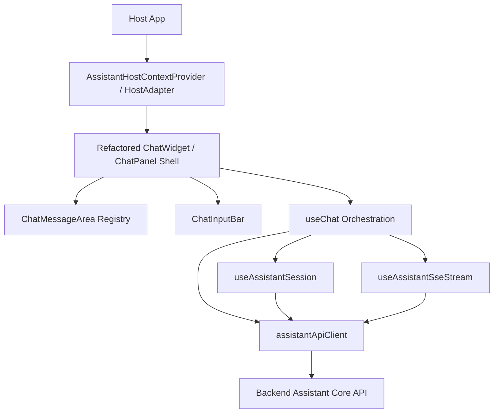
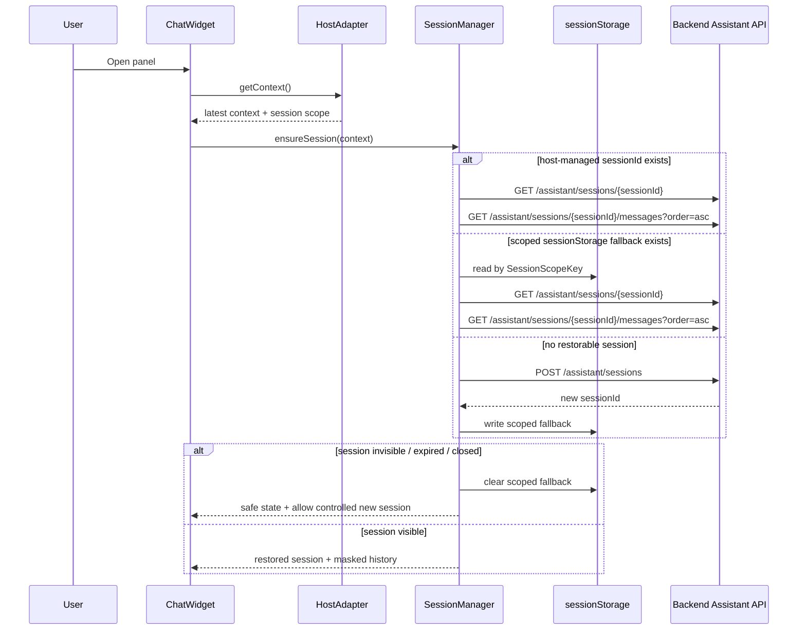
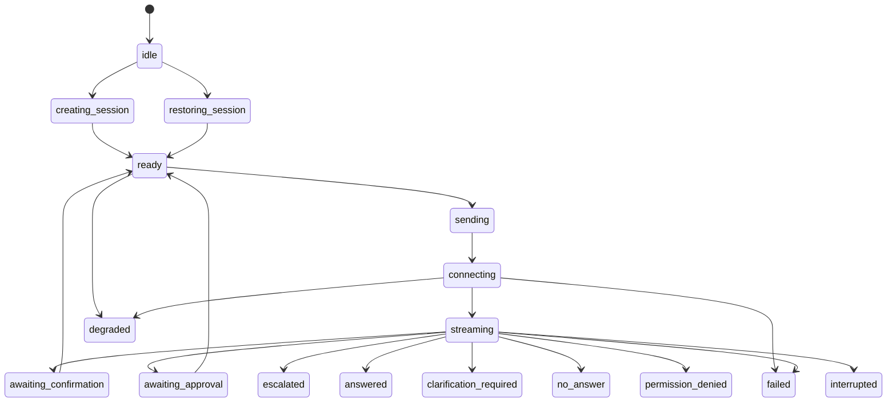

# Design: Internal Assistant Embedded Chat Panel

## 1. Overview

本文件描述 `001-internal-assistant-embedded-chat-panel` 的前端架構設計，用於支撐後續 `plan.md` 與 `tasks.md` 的實作規劃。

本 feature 是企業內部後台 AI 助理的 embedded chat panel，不是 public chatbot，不是客服 widget，不是 lead capture，不是 customer handoff flow，不是 backend assistant core，不是 connector layer，也不是 approval management UI。

本 design 採用：

- `reuse-first + contract-driven refactor`

其核心意思是：

- 優先沿用 `docs/reference/legacy-chatbot-widget/raw/` 中舊 widget 已驗證過的 UI shell、message registry、input interaction、streaming placeholder 與 orchestration 概念。
- 舊檔案只作為 reference-only，不是新版 internal assistant 的 production modules，不能在未來實作中直接視為 `src/` 既有模組 import。
- 所有會影響 session、history、SSE、AnswerDecision、evidence、ActionDraft、ApprovalRequest、feedback 的行為，都必須以目前 backend assistant API contract handoff 為唯一外部契約來源。

本 design 的固定原則：

- Backend is source of truth
- SSE-first
- Contract-driven
- Secure-by-default
- Host-app agnostic
- Embeddable and accessible
- Reuse-first without carrying over public chatbot semantics
- Testable with mock fixtures

## 2. Existing Widget Reuse Assessment

| Existing reference file | Current responsibility | Reusable concept | Reuse decision | Required refactor | Target internal assistant module / role | Risks |
|---|---|---|---|---|---|---|
| `useChatWidgetStore.ts` | 控制 widget 開關與 display mode | `isOpen`、`toggle`、`setOpen`、頂層 display mode store | reuse with refactor | 將 `fallback` mode 改為 internal assistant 的 `normal / context_not_ready / degraded / unavailable`，移除 public fallback 語意 | `useChatWidgetStore` 或等效 widget shell state store | 若沿用原 mode 語意，會把 public 客服 fallback 邏輯帶入新版 |
| `useChatSessionStore.ts` | 保存 session token、messages、streaming、handoff、lead form、quick replies | session/message store、append/update/reset pattern | reuse with refactor | `sessionToken` 改為 `sessionId`，移除 lead/handoff/public quick replies state，新增 session scope、history cursor、ActionDraft、ApprovalRequest、feedback state | `useAssistantSessionStore` | 若直接沿用，會保留 public chatbot / lead / handoff state 與 localStorage token 假設 |
| `useChatSession.ts` | 以 localStorage token 建立/還原 session 與歷史訊息 | session lifecycle orchestration、create/restore/restart pattern | rewrite logic but keep concept | 改成 host-managed sessionId 優先、`sessionStorage` scoped fallback、`GET /assistant/sessions/:sessionId/messages`、`nextCursor` 分頁、safe restore failover | `useAssistantSession` | 直接沿用會依賴 localStorage token、`/history` 形態與 full restore assumptions |
| `useStreaming.ts` | token-based streaming controller，負責 timeout、cancel、onDone | timeout、cancel、interrupted、stream placeholder update | rewrite logic but keep concept | 全面重寫成 contract-driven SSE parser，支援 event union、`sequence`、`final.data.answerDecision`、confirmation/approval/escalation state | `useAssistantSseStream` | 直接沿用會把 `onDone = final`、simple token stream 與 public stream cancel 語意帶入 |
| `useChat.ts` | send → append user → append streaming placeholder → stream → terminal fallback | orchestration pattern、retry/cancel/send 流程骨架 | reuse with refactor | send 前要抓 latest PageContext、ensure session、generate requestId、改為 backend feedback API、不再用 local rating toggle | `useChat` | 若不重構，會把 stream terminal state 與 feedback 視為 local UI toggle |
| `ChatWidget.vue` | fixed bottom-right widget root，整合 locale、launcher、panel、session init | widget root shell、launcher/panel 切換、初始化入口 | reuse with refactor | 支援 embedded mode 與 launcher mode，移除 fixed-only 假設、public wording、locale localStorage 核心依賴、body-level customer widget 假設 | `ChatWidget` / `AssistantPanelRoot` | 直接沿用會保留 public launcher copy 與單一定位策略 |
| `ChatPanel.vue` | 面板 shell、header、info bar、message area、input bar、disclaimer | panel shell layout、header/footer layout、main scroll region | reuse with refactor | header/info/disclaimer 全部改成 internal assistant 語意，移除 phone/email/contact us/customer disclaimer，改為 context summary / degraded state / host theme token | `ChatPanel` | 直接沿用會把客服導向資訊列與對外聯絡語意保留下來 |
| `ChatMessageArea.vue` | message registry 渲染、empty state、quick replies、自動捲動 | message registry pattern、auto-scroll、empty state rendering | reuse with refactor | 移除 lead/handoff/public system message types，新增 internal assistant card types，empty state 改成 internal assistant welcome / prompt suggestions | `ChatMessageArea` | 若只做微調，可能殘留 lead form / handoff card 與 public quick reply semantics |
| `ChatInputBar.vue` | textarea、send/cancel、Enter/Shift+Enter、500 字限制、fallback disable | input UX、textarea interaction、send/cancel affordance | reuse with small changes | disabled 規則改為 context/session/streaming/degraded/internal confirmation rule，移除 public fallback 文案 | `ChatInputBar` | 若 disabled 條件沒重構，會誤綁定 public fallback state |
| `UserMessageItem.vue` | 使用者 bubble 與 timestamp 呈現 | right-aligned user bubble、時間顯示 | reuse with small changes | 對齊 `messageId` / `createdAt` / internal theme token，不再依賴舊 `id` / `timestamp` 命名 | `UserMessageItem` | 風險低，但若保留舊型別假設會與 history/assistant contract 不一致 |
| `AiStreamingItem.vue` | streaming placeholder / token append bubble | typing indicator、partial answer bubble、cursor UI | reuse with refactor | content 改由 `answer_delta` 驅動，finalization 必須等 `final`，interrupted/timeout/error after partial 不可轉 answered | `AiStreamingItem` | 若直接沿用，會把 streaming done 視為 message 完成 |
| `AiMessageItem.vue` | AI bubble、markdown、timestamp、thumb up/down、reason chips、quick replies | assistant bubble 外觀、markdown、feedback UI appearance | reuse with refactor | feedback contract 改為 `positive/negative/neutral + intent/reason/comment`，加入 AnswerDecision badge、evidence display，移除把 clarification/no-answer/approval 全塞一般 AI bubble 的假設 | `AiMessageItem` | 若直接沿用，會延續 local feedback toggle 與 public quick replies/handoff semantics |

## 3. Reuse Decision Summary

### 3.1 高比例可沿用的概念

- widget open / close / toggle state
- panel shell layout
- message list 與 auto-scroll
- user bubble
- assistant bubble 的基本視覺結構
- streaming placeholder / typing indicator
- input composer
- send / cancel / retry interaction
- message registry pattern
- basic feedback UI appearance

### 3.2 需要重構的概念

- `sessionToken` → `sessionId`
- localStorage token restore → host-managed sessionId priority + `sessionStorage` scoped fallback
- simple token stream → contract-driven SSE event union
- `onDone` finalization → `final.data.answerDecision`
- `up/down` feedback → `positive | negative | neutral` + `intent / reason / comment`
- quick replies → internal prompt suggestions，不再承擔 lead / customer-support guidance
- widget config / public locale persistence → host app config / runtime config / theme override
- public fallback mode → internal assistant `context_not_ready / degraded / unavailable`

### 3.3 必須移除或不得帶入的概念

- lead form
- public customer handoff
- customer support contact flow
- public chatbot fallback copywriting
- anonymous visitor assumptions
- lead capture quick replies
- public customer service disclaimer
- localStorage 長期敏感 session strategy
- fixed bottom-right 為唯一掛載模式

## 4. Target Architecture Overview

新版 internal assistant 採「沿用 shell 與互動概念、重寫契約敏感邏輯」的架構。

- Host app 提供 `AssistantHostContextProvider` / `HostAdapter`
- Widget / Panel 負責容器、layout、focus 與 embedded mode
- orchestration、session、SSE parser、API client 各自分離
- API client 與 SSE parser 不得散落在 Vue components 中
- props adapter 只作為 demo / test fallback，正式嵌入以 Provider / Adapter 模式為主



### 4.1 Module Boundaries

- **Host adapter layer**
  - 提供 identity headers、host app boundary、latest PageContext、session scope、host-managed sessionId、`onOpenApprovalDetail`
- **Shell/UI layer**
  - `ChatWidget`、`ChatPanel`、`ChatMessageArea`、`ChatInputBar`、message item / card components
- **State / orchestration layer**
  - `useChatWidgetStore`
  - `useAssistantSessionStore`
  - `useChat`
  - `useAssistantSession`
  - `useAssistantSseStream`
- **Integration layer**
  - `assistantApiClient`
  - `assistantSseParser`
  - `pageContextSanitizer`
  - `requestIdGenerator`
  - `sessionScopeKeyGenerator`
  - `evidenceNormalizationAdapter`
  - `answerDecisionStateMapper`

## 5. Component Reuse and Refactor Design

### 5.1 ChatWidget

`ChatWidget` 應由 public chatbot root 重構為 internal assistant root。

保留概念：

- widget root / shell ownership
- launcher 與 panel 切換
- 初始化 orchestration 的入口點

重構方向：

- 支援 `embedded mode` 與 `launcher mode`
- 不再強制 fixed bottom-right
- launcher mode 只是一種 host app 可選的展示模式，不是唯一模式
- 移除 public customer service wording
- 移除 public lead / handoff initialization assumption
- session init 必須改走 internal session manager
- locale localStorage 不應成為核心依賴
- widget config 不應作為 backend contract source
- host theme / design token 應可覆寫 panel shell 樣式

目標角色：

- 掛載 panel
- 控制 open / close
- 與 host adapter 建立整合
- 管理 focus 進出與 embedded/launcher 模式切換

### 5.2 ChatPanel

`ChatPanel` 沿用現有 shell layout，但語意改為 internal assistant panel。

必須重構：

- header wording 改為 internal assistant
- 移除 phone / email / contact us
- 移除客服導向 disclaimer
- Info bar 改為 context summary、degraded state、safe status
- 支援 host theme / design token
- 支援 narrow container
- 支援 embedded layout

建議區塊：

- Header：assistant title、context badge、close / reset / degraded indicator
- Context / Status bar：當前 host app、route / entity summary、degraded / unavailable 提示
- Main：message registry
- Footer：input + assistive status + minimal safe help text

### 5.3 ChatMessageArea

`ChatMessageArea` 應沿用 message registry pattern，不重新發明一套 if/else message 渲染系統。

必須移除：

- lead form message types
- customer handoff message types
- public support fallback message types

必須新增或支援的 internal assistant message / card types：

- answered assistant message
- streaming message
- clarification card
- no-answer card
- permission denied card
- tool failure card
- evidence display block
- ActionDraft confirmation card
- ApprovalRequest display-only card
- escalation card
- degraded / interrupted / timeout state

其他要求：

- empty state welcome message 不依賴 public widget config
- quick replies 若保留，只能作為 internal prompt suggestions
- registry 應能將 final `answerDecision` 與 safe failure 狀態映射到不同 component

### 5.4 ChatInputBar

`ChatInputBar` 可沿用 textarea / send / cancel / Enter / Shift+Enter / max chars 的 UX 概念。

需改造：

- disabled state 不再由 public fallback 決定，而是由以下 internal assistant 條件決定：
  - context provider not ready
  - session creating / restoring
  - streaming
  - backend degraded / unavailable
  - action confirmation state rules
- send event 仍只 emit text，但 orchestration 必須在 send 前取得 latest PageContext
- cancel stream 只取消 active stream，不代表取消 ActionDraft / ApprovalRequest
- public fallback copywriting 必須移除

### 5.5 UserMessageItem

`UserMessageItem` 可直接沿用大部分 bubble / layout 概念。

調整重點：

- 對齊 `messageId`
- 對齊 `createdAt`
- 不依賴舊 `id` / `timestamp` 命名
- 不帶 public chatbot styling assumption

### 5.6 AiStreamingItem

`AiStreamingItem` 保留 streaming bubble 與 typing indicator 概念，但行為必須對齊 assistant SSE contract。

必要規則：

- content 來源改為 `answer_delta`
- finalization 必須等待 `final` event
- interrupted / timeout / error after partial answer 不得轉成 answered
- 不再依賴 simple token stream `done`

### 5.7 AiMessageItem

`AiMessageItem` 可沿用 assistant bubble、markdown rendering 與 feedback UI appearance。

重構要點：

- markdown rendering 可作為 answered state 的內容呈現方式
- 加入 `AnswerDecision` badge / state
- 加入 evidence display
- feedback contract 改成 backend handoff 的 `rating / intent / reason / comment`
- feedback 必須關聯 `messageId` 與 `requestId`
- no-answer / permission-denied / clarification / confirmation / approval 不應全部塞進一般 AI bubble
- 不得暴露 raw evidence / raw tool output / full document text

## 6. Composable / Store Refactor Design

### 6.1 useChatWidgetStore

可保留概念：

- `isOpen`
- `toggle`
- `setOpen`
- display mode

需要改造：

- mode 改成 internal assistant display mode：
  - `normal`
  - `context_not_ready`
  - `degraded`
  - `unavailable`
- store 不承擔 backend `AnswerDecision`
- store 不承擔權限判斷

### 6.2 useChatSessionStore

legacy store 應重構為 internal assistant session/message store。

新版 state 至少包含：

```txt
sessionId
sessionStatus
sessionScope
sessionScopeKey
messages
nextCursor
streamingState
activeRequestId
activeAssistantMessageId
pendingActionDraft
approvalStatus
degradedState
feedbackStates
contextReady
lastError
```

應明確移除或降級：

```txt
sessionToken
leadFormState
public handoffState
quickRepliesVisible as lead/customer-support concept
```

若 quick replies 保留，只能作為 internal prompt suggestions，不得作為 lead capture 或 customer support entry point。

store 不得：

- 做權限判斷
- 保存完整 tool payload
- 保存 raw evidence payload
- 保存完整 prompt
- 保存 long-term sensitive content
- 保存 public lead / handoff state

### 6.3 useChatSession

`useChatSession` 應設計為新版 session manager。

legacy 可保留概念：

- init session
- restore session
- create new session
- clear / restart session

但 restore 策略必須改成：

```txt
1. host-managed sessionId
2. sessionStorage fallback by SessionScopeKey
3. create new session
```

history endpoint 必須固定為：

```txt
GET /api/v1/assistant/sessions/:sessionId/messages
```

query：

```txt
limit
cursor
order=asc
```

response：

```txt
nextCursor
```

不得使用：

- `/history`
- localStorage token as primary strategy
- `hasMore`
- `order=desc`
- full history local cache
- raw evidence / raw tool output

### 6.4 useStreaming

`useStreaming` 應重構為新版 assistant SSE stream controller。

可保留概念：

- timeout
- cancel
- interrupted
- streaming placeholder update

核心邏輯必須重寫為 contract-driven SSE event stream。

request：

```txt
POST /api/v1/assistant/sessions/:sessionId/messages
Request Content-Type: application/json
Request Accept: text/event-stream
Response Content-Type: text/event-stream
```

每個 SSE event 都有：

```txt
requestId
sessionId
messageId
eventType
sequence
data
```

必須支援 event types：

```txt
tool_call_started
tool_call_completed
tool_call_blocked
tool_call_failed
evidence_attached
answer_delta
confirmation_required
approval_required
escalation_required
final
error
```

parser 行為：

- 使用 `sequence` 做 ordering / de-dup / debug
- `answer_delta` append 到 streaming message
- `evidence_attached` 更新 evidence refs
- `confirmation_required` 建立 ActionDraft UI state
- `approval_required` 建立 ApprovalRequest display state
- `escalation_required` 建立 escalation state
- `error` 不得當成 answered
- 只有 `final.data.answerDecision` 能決定 final state
- unknown event safe fallback
- interrupted / timeout / error after partial answer 必須進入 safe UI state

不得：

- 用 `onDone` 直接把 message 轉成 answered AI message
- 用 quick reply payload 判斷 final state
- 從中途 event 推論 authorization result
- 發明 `tool_failed` final state

### 6.5 useChat

沿用 orchestration pattern，但改成 internal assistant flow。

新版 flow：

```txt
sendMessage(text)
  -> validate text
  -> get latest host context
  -> ensure session
  -> generate requestId
  -> append user message
  -> append assistant streaming placeholder
  -> call assistant SSE stream
  -> handle answer_delta
  -> handle evidence_attached
  -> handle confirmation_required
  -> handle approval_required
  -> handle escalation_required
  -> handle final
  -> update message final state
```

需明確說明：

- retry 必須重新取得 latest PageContext
- cancel stream 不等於 cancel ActionDraft
- cancel stream 不等於 cancel ApprovalRequest
- terminal state 由 `AnswerDecision` / stream failure 決定
- feedback 不只是 local rating toggle，必須呼叫 backend feedback API

## 7. New Gaps to Add Beyond Legacy Widget

legacy widget 不具備、但 internal assistant 必須新增的設計缺口如下：

- `AssistantHostContextProvider`
- `assistantApiClient`
- `assistantSseParser`
- `sessionScopeKeyGenerator`
- `pageContextSanitizer`
- `requestIdGenerator`
- `evidenceNormalizationAdapter`
- `answerDecisionStateMapper`
- `ActionDraftConfirmationCard`
- `ApprovalRequestDisplayCard`
- `feedbackApiIntegration`
- contract-aligned mock SSE fixtures
- internal assistant safe states

這些是缺口，不代表要重建所有既有 UI；應優先與 legacy shell、registry、message item、input composer 融合，而不是平行重做整套元件。

## 8. Host Context Provider Design

`AssistantHostContextProvider` / `HostAdapter` 是正式嵌入模式，負責提供 runtime 最新 host context 與 integration boundary。

必須涵蓋：

- context readiness
- identity headers source
- host app boundary
- organization boundary
- actor context
- route
- `screenId`
- `entityType` / `entityId`
- `selectedRows`
- `activeFilters`
- `visibleColumns`
- `userVisibleState`
- session scope
- host-managed sessionId
- `onOpenApprovalDetail`

關鍵規則：

- 每次 send message 前必須讀取最新 context
- 不使用過期 snapshot
- context 不足時不得由前端猜測資料
- host adapter 必須 sanitize context
- `selectedRows`、`activeFilters`、`userVisibleState` 不得包含 raw payload / hidden fields / secret fields / complete table state
- 前端不得用 context 做權限判斷
- props adapter 只可作為 demo / test fallback
- 正式嵌入應優先使用 Provider / Adapter 模式

session scope key 生成概念：

```txt
global: actor + organization + hostApp
page: actor + organization + hostApp + route/screenId
entity: actor + organization + hostApp + entityType + entityId
```

## 9. Session Manager Design

### 9.1 Restore Priority

```txt
1. host-managed sessionId
2. sessionStorage fallback by SessionScopeKey
3. create new session
```

### 9.2 Session Storage Rules

- 只保存 `sessionId`
- 可保存最小 UI continuity state
- 不保存完整 message history
- 不保存 tool result
- 不保存 evidence payload
- 不保存 prompt
- 不使用 localStorage 長期保存敏感內容

### 9.3 History Loading

必須使用：

```txt
GET /api/v1/assistant/sessions/:sessionId/messages
```

query：

```txt
limit
cursor
order=asc
```

response：

```txt
nextCursor
```

固定規則：

- 不使用 `/history`
- 不使用 `order=desc`
- 不依賴 `hasMore`
- `nextCursor !== null` 表示可載入更多
- history 只顯示 masked summary
- session expired / closed / invisible 時清除 fallback sessionId 並 fail safe

restore flow：



## 10. Message Sending and SSE Stream Design

### 10.1 Request

```txt
POST /api/v1/assistant/sessions/:sessionId/messages
Request Content-Type: application/json
Request Accept: text/event-stream
Response Content-Type: text/event-stream
```

request body 必須包含：

- `message`
- latest `pageContext`

headers 必須包含或由 host app 提供：

- `x-request-id`
- `x-actor-id`
- `x-organization-id`
- `x-host-app`
- `x-role`
- `x-permission-scopes`

### 10.2 SSE Base Fields

每個 event 保證：

- `requestId`
- `sessionId`
- `messageId`
- `eventType`
- `sequence`

### 10.3 Known Event Types

- `tool_call_started`
- `tool_call_completed`
- `tool_call_blocked`
- `tool_call_failed`
- `evidence_attached`
- `answer_delta`
- `confirmation_required`
- `approval_required`
- `escalation_required`
- `final`
- `error`

### 10.4 Parser Behavior

- 依 `sequence` ordering / de-dup
- `answer_delta` append partial answer
- `evidence_attached` 更新 evidence display source
- `confirmation_required` 建立 ActionDraft UI state
- `approval_required` 建立 ApprovalRequest status UI state
- `escalation_required` 建立 escalation display state
- `error` 不可當 answered
- `final` 才能決定 final message state
- unknown event safe fallback
- stream interrupted / timeout / error after partial answer 必須進入 safe UI state

### 10.5 Message State Machine



狀態說明：

- **transient**
  - `creating_session`
  - `restoring_session`
  - `sending`
  - `connecting`
  - `streaming`
- **final or quasi-final UI state**
  - `answered`
  - `clarification_required`
  - `no_answer`
  - `permission_denied`
  - `awaiting_confirmation`
  - `awaiting_approval`
  - `escalated`
  - `failed`
  - `interrupted`
  - `degraded`
- **retryable**
  - `failed`
  - `interrupted`
  - `degraded`
  - 部分 `no_answer`
  - `clarification_required`

## 11. AnswerDecision and Safe UI Design

final answer state 必須使用 backend public enum：

```txt
answered
clarification_required
no_answer
confirmation_required
approval_required
escalation_required
permission_denied
```

固定規則：

- `final.data.answerDecision` 是唯一 final state source
- 不從 `answer` 是否存在推測狀態
- 不從中途 SSE event 推測 authorization result
- `tool_failure` 是 `NoAnswerReason`，不是 `AnswerDecisionStatus`
- tool failure UI 條件是：

```txt
answerDecision = no_answer
noAnswerReason = tool_failure
```

各狀態 UI 行為：

- **answered**
  - 顯示 markdown answer、evidence、feedback controls
- **clarification_required**
  - 顯示 clarification question card，保留原對話脈絡
- **no_answer + no_evidence**
  - 顯示安全無答案 card，建議使用者提供更多可驗證資訊
- **no_answer + tool_failure**
  - 顯示 tool failure safe card，不顯示 stale evidence，不建立 `tool_failed` final state
- **no_answer + missing_page_context**
  - 顯示缺少 page context 提示，引導使用者回到可識別的 host context
- **no_answer + evidence_conflict**
  - 顯示 evidence conflict 安全提示，不自行合成答案
- **permission_denied**
  - 顯示 permission denied card，不回退為一般 answered
- **escalation_required**
  - 顯示 escalation card 與 reason summary
- **confirmation_required**
  - 顯示 ActionDraft confirmation card
- **approval_required**
  - 顯示 ApprovalRequest display-only card

## 12. Evidence Display Design

backend 可能回：

- `EvidenceRefSummary[]`
- `string[]`

### 12.1 若為 `EvidenceRefSummary[]`

UI 可顯示：

- `sourceType`
- `title`
- `snippet`
- safe source summary
- `structured_record` / `document_chunk` 區分
- optional `toolCallId` / `sourceId`，僅在安全且已提供時顯示

### 12.2 若為 `string[]`

UI 只能顯示：

- safe evidence reference chip
- evidence id / short id

UI 不得：

- 自行補造 `title`
- 自行補造 `snippet`
- 自行補造 `sourceType`
- 自行補造 document content
- 自行還原 raw evidence
- 自行查 raw evidence detail
- 顯示 raw tool output
- 顯示 full document text

### 12.3 Evidence Display Adapter

引入 normalized `EvidenceReferenceDisplay` adapter，使 UI 可以統一吃 normalized display model，但保留原始 contract shape 的安全限制。

正規化後模型至少區分：

- `summary`
  - for `EvidenceRefSummary[]`
- `reference`
  - for `string[]`

此 adapter 只做顯示轉換，不補造 backend 未提供的語意欄位。

## 13. Feedback Flow Design

backend endpoint：

```txt
POST /api/v1/assistant/messages/:messageId/feedback
```

request 支援：

```txt
rating: positive | negative | neutral
intent: correction | unsafe | not_helpful | missing_evidence | other
reason?: string
comment?: string
```

設計重點：

- feedback controls 只有 assistant message 到達 final 後才顯示
- feedback 必須關聯 `messageId` 與 `requestId`
- UI 必須支援 success / failed / retry 狀態
- 需避免 duplicate submission，或至少提供可理解 duplicate UX
- 前端不得自行建立 `ReviewItem`
- comment 不應被假設原樣反映到 audit / review metadata
- sensitive comment 不得主動寫入 console / analytics
- 舊 `up/down` feedback UI 外觀可沿用，但 contract mapping 必須改為 `positive/negative/neutral + intent`

## 14. ActionDraft Confirmation Design

endpoints：

```txt
GET /api/v1/assistant/action-drafts/:actionDraftId
POST /api/v1/assistant/action-drafts/:actionDraftId/confirm
POST /api/v1/assistant/action-drafts/:actionDraftId/cancel
```

UI 必須包含：

- action preview
- risk summary
- `expiresAt`
- confirm
- cancel
- loading state
- confirmed / cancelled / expired / failed state
- error state

固定規則：

- confirm 必須支援 `idempotencyKey`
- confirm response 可能包含 `pending_execution_guard`
- `pending_execution_guard` 不代表 side-effect 已安全執行
- UI 不得顯示「操作已安全完成」，除非 backend contract 未來明確提供 executed / completed 安全語意
- expired / failed / cancelled 時不能再允許 confirm
- confirm / cancel API failed 時不能假設成功

## 15. ApprovalRequest Display-only Design

backend 可能提供：

```txt
GET /api/v1/assistant/approval-requests/:approvalRequestId
```

但本 feature 只做 display-only。

UI 必須包含：

- `approvalRequestId`
- status
- `riskLevel`
- action summary
- payload summary if safe
- `expiresAt`
- evidence chips 或 safe evidence summary
- open detail action

固定規則：

- 使用 `onOpenApprovalDetail` callback 交給 host app 開啟 approval detail
- 不實作 approval management UI
- 不實作 approver 待審清單
- 不實作 inline approve / reject / cancel
- 不顯示 approve / reject / cancel buttons
- backend 雖有 approve / reject / cancel endpoint，但屬 future approval-management feature
- 若未來要做 inline approval，必須另開 spec，且依 backend-provided `canApprove` / `allowedActions` 或等效 authorization fields

## 16. Embedded Layout and Accessibility Design

layout 與 accessibility 設計目標是讓 panel 能嵌入不同 host app，而不是只服務單一 full-page 客服 widget。

必須涵蓋：

- launcher mode
- embedded container mode
- panel open / close
- narrow width
- responsive layout
- keyboard navigation
- focus trap 或適合 embedded panel 的 focus management
- ARIA labels
- ARIA live region for streaming
- screen reader readable states
- high contrast / reduced motion consideration
- confirmation / approval card 的鍵盤可操作性
- error / interrupted / degraded 狀態可理解

固定限制：

- 不假設 full-page app
- 不假設單一 host app layout
- 不強制 fixed bottom-right
- 不強制固定 theme
- 應允許 host app theme integration 或 design token override

## 17. Error, Retry, and Degraded State Design

必須涵蓋：

- context provider not ready
- session create failed
- session restore failed
- session invisible / expired / closed
- history cursor invalid
- send message failed before stream
- stream interrupted before final
- timeout waiting for final
- error event after partial answer
- backend degraded
- feedback failed
- action draft confirm / cancel failed
- approval detail load failed
- unknown SSE event

處理策略：

- **可 retry**
  - send message failed before stream
  - stream interrupted before final
  - timeout waiting for final
  - error event after partial answer
  - feedback failed
  - approval detail load failed
- **需 start new session**
  - session invisible / expired / closed
  - restore target not found after fallback clear
- **只能停在 safe terminal state**
  - permission denied
  - no_answer + no_evidence / evidence_conflict / tool_failure
  - escalation_required
  - approval_required display-only
- **需顯示 not-ready / degraded**
  - context provider not ready
  - backend degraded
  - unknown SSE event 不可中斷整體 UI，但需記錄 safe fallback 狀態

## 18. Data Privacy and Storage Design

固定策略：

- `sessionStorage` fallback 只保存 `sessionId` 與最小 UI continuity state
- 不保存完整 history
- 不保存 tool result
- 不保存 raw evidence payload
- 不保存 full document text
- 不保存完整 prompt
- 不保存 connector secret / OpenAI key / backend credential
- 不將 sensitive data 放入 URL query
- 不將 sensitive payload 寫入 console log / analytics
- mock fixtures 必須使用 synthetic 或 de-identified data
- `PageContext` 必須 sanitized
- `selectedRows` / `activeFilters` / `userVisibleState` 必須只包含 visible、non-secret summary
- 舊 public chatbot localStorage token 策略不可沿用為新版 internal assistant session 策略

## 19. Testing Strategy

### 19.1 Unit / Pure Logic Tests

- session scope key generation
- `sessionStorage` fallback logic
- requestId generation / propagation
- `PageContext` sanitization
- SSE parser
- `sequence` ordering / de-dup
- AnswerDecision mapping
- EvidenceRef normalization
- ActionDraft state transition
- ApprovalRequest display state
- feedback state transition
- existing component registry mapping

### 19.2 Component Tests

- refactored `ChatWidget` open / close
- refactored `ChatPanel` embedded / launcher mode
- `ChatInputBar` send / cancel / disabled states
- `ChatMessageArea` registry
- `UserMessageItem`
- `AiStreamingItem`
- `AiMessageItem` answered state
- evidence summary / chips
- clarification card
- no-answer card
- permission denied card
- ActionDraft card
- ApprovalRequest card
- feedback controls
- error / interrupted / degraded state
- narrow container
- keyboard navigation / focus behavior

### 19.3 Contract-oriented Tests

使用 contract handoff / fixtures 驗證：

- history endpoint `/api/v1/assistant/sessions/:sessionId/messages`
- `order=asc`
- `nextCursor`
- no `hasMore`
- send message SSE event union
- `tool_failure = no_answer + noAnswerReason=tool_failure`
- `evidenceRefs = string[] | EvidenceRefSummary[]`
- `approval_required` display-only
- `pending_execution_guard` handling

### 19.4 Mock Fixtures

需要的 mock fixtures：

- answered structured lookup
- answered document retrieval
- clarification required
- no answer / no evidence
- no answer / tool failure
- permission denied
- confirmation required
- approval required
- escalation required
- stream interrupted
- error after partial answer
- unknown SSE event
- history pagination
- session expired / invisible

## 20. Non-goals / Out of Scope

本 design 不包含：

- backend assistant core
- real ERP / MES / WMS / SCM / CRM connector
- OpenAI / LLM provider
- RAG pipeline
- tool execution engine
- approval backend implementation
- complete approval management UI
- approver pending list
- inline approve / reject / cancel
- admin review APIs
- internal observability endpoints
- public website chatbot
- anonymous visitor support
- lead capture
- customer service handoff
- production deployment / CI/CD / Kubernetes / Helm

## 21. Assumptions / Contract Boundaries

- backend contract handoff 是唯一 API surface source
- history endpoint 是 `/api/v1/assistant/sessions/:sessionId/messages`
- history 只支援 `order=asc`
- `nextCursor` 是 pagination indicator
- 沒有 `hasMore`
- send message request 是 JSON
- send message response 是 SSE
- SSE final state 只看 `final.data.answerDecision`
- SSE event 有 `requestId` / `sessionId` / `messageId` / `eventType` / `sequence`
- `tool_failure` 是 `NoAnswerReason`，不是 `AnswerDecisionStatus`
- `evidenceRefs` 可能是 `string[]` 或 `EvidenceRefSummary[]`
- ApprovalRequest operation endpoints 屬 future approval-management feature
- raw evidence / raw tool output / full document text 不在 frontend UI contract 中
- existing public chatbot widget files are reusable only where their concept matches internal assistant behavior
- existing lead / handoff / public customer service concepts must not be carried into this feature
- constitution 目前仍出現 `tool_failed` 文字，但 backend handoff 與已通過 spec 明確要求 internal assistant frontend 只能以 `no_answer + noAnswerReason = tool_failure` 呈現 tool failure；本 design 以 handoff + 已通過 spec 的 contract semantics 為實作依據
